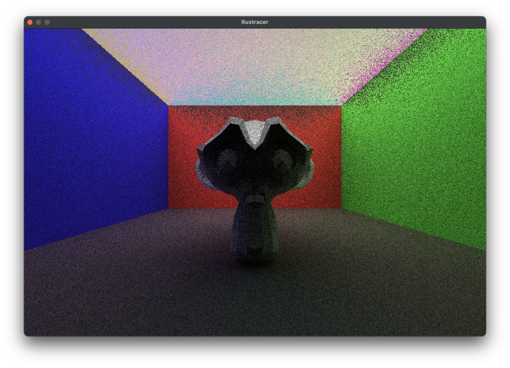
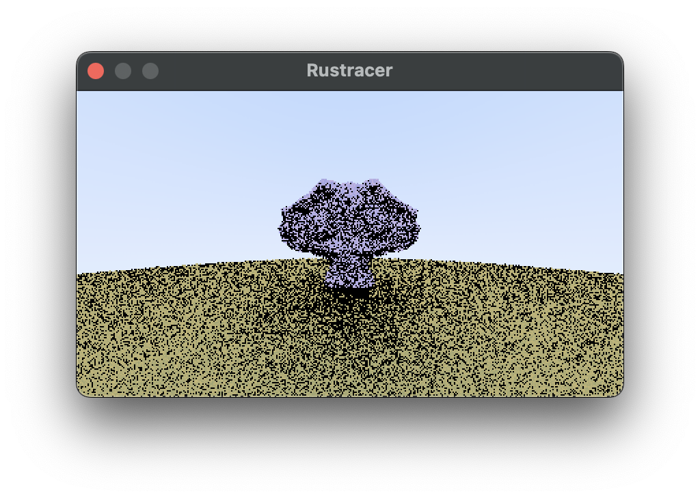

# Porting Ray Tracing to Rust and WebGPU

## Introduction



In this post, I’ll walk through my journey of extending the [Ray Tracing Road to Rust (RTRR)](https://the-ray-tracing-road-to-rust.vercel.app/6-surface-normals-and-multiple-objects) project. I’ll cover how I added triangle support, imported geometry from OBJ files, and started porting the project to WebGPU. If you havent yet done the RTRR then I recommend starting there. If you want to follow along with me without completing RTRR then clone [this branch of the repository (week1)](https://github.com/Jake-Purton/webgpu_ray_trace/tree/week1).

## Adding Triangles to the CPU Version

RTRR is a fantastic project for beginners learning rust or ray tracing. It focuses mainly on spheres and I wanted to add triangles. The specific working commit on the CPU is [here](https://github.com/Jake-Purton/webgpu_ray_trace/tree/b26dc46eb08a39acbcfbff3ad3bbe284c25d8d4d) in my repository. Please note that my obj file reading wasn't correct at the time but it was close enough to see some triangles.

**The Triangle Struct**
```rust
// triangle.rs
use std::sync::Arc;

use crate::hittable::{HitRecord, Hittable};
use crate::material::Material;
use crate::ray::Ray;
use crate::vec3::{self, Point3, unit_vector};

pub struct Triangle {
    pub a: Point3,
    pub b: Point3,
    pub c: Point3,
    pub mat: Arc<dyn Material + Send + Sync>,
}

impl Triangle {
    pub fn new(a: Point3, b: Point3, c: Point3, m: Arc<dyn Material + Send + Sync>) -> Triangle {
        Triangle {
            a,
            b,
            c,
            mat: m,
        }
    }
}

impl Hittable for Triangle {
    fn hit(&self, r: &Ray, t_min: f32, t_max: f32, rec: &mut HitRecord) -> bool {
        // Möller–Trumbore intersection algorithm
        let epsilon = 1e-8;
        let edge1 = self.b - self.a;
        let edge2 = self.c - self.a;
        let h = vec3::cross(r.direction(), edge2);
        let a = vec3::dot(edge1, h);

        if a.abs() < epsilon {
            return false; // Ray is parallel to triangle
        }

        let f = 1.0 / a;
        let s = r.origin() - self.a;
        let u = f * vec3::dot(s, h);

        if u < 0.0 || u > 1.0 {
            return false;
        }

        let q = vec3::cross(s, edge1);
        let v = f * vec3::dot(r.direction(), q);

        if v < 0.0 || u + v > 1.0 {
            return false;
        }

        let t = f * vec3::dot(edge2, q);

        if t < t_min || t > t_max {
            return false;
        }

        rec.t = t;
        rec.p = r.at(t);
        let outward_normal = unit_vector(vec3::cross(edge1, edge2));
        rec.set_face_normal(r, outward_normal);
        rec.mat = Some(self.mat.clone());
        true
    }
}
```

This implements the tutorial's `Hittable` trait and can therefore be added to world like so.

```rust
    world.add(Box::new(Triangle::new(
        Point3::new(-4.0_f32, -1.0_f32, -1.0_f32),
        Point3::new(4.0_f32, -1.0_f32, -1.0_f32),
        Point3::new(-4.0_f32, -1.0_f32, -6.0_f32),
        material_ground.clone(),
    )));
```


## Reading Triangles from OBJ Files

To render real models, I used `tobj` to load triangles from OBJ files. Here is an example loading the file 'suzanne.obj'.

```rust
let (models, _) = tobj::load_obj(
    "suzanne.obj",
    &tobj::LoadOptions {
        triangulate: true,
        single_index: true,
        ..Default::default()
    },
)
.unwrap();

for model in models {
    let mesh = &model.mesh;
    let positions = &mesh.positions;
    let indices = &mesh.indices;

    for i in (0..indices.len()).step_by(3) {
        let i0 = indices[i] as usize * 3;
        let i1 = indices[i + 1] as usize * 3;
        let i2 = indices[i + 2] as usize * 3;

        // the points are in:
        // positions[i0], positions[i0+1], positions[i0+2]
        // positions[i1], positions[i1+1], positions[i1+2]
        // positions[i2], positions[i2+1], positions[i2+2]
        // and can be turned into Triangle objects and passed into World

    }
}
```


## Preparing for WebGPU

Currently, with ray tracing running on the CPU the simulation is slow even on relatively high end hardware. An example that took me 30 seconds to generate:



We can get a huge boost in speed by sending our triangles to the GPU to have the simulation run in paralel there. This will involve sending our triangles in a buffer, implementing a ray tracing shader, and recieving the results as pixels in another buffer before displaying this to the screen.


### Input and Output Buffers

Here is what the setup looks like for sending triangles to the GPU. In the loop where we read the triangles from the obj file before, we now populate a `Vec<u8>`. Our goal is to send 3 sets of 3 `f32`s, however because of how wgsl reads buffers we actually need 4 bytes of padding between each point in the triangle.

```rust
let mut triangles: Vec<u8> = Vec::new();
let suzanne_offset = -2.5;
for model in models {
    let mesh = &model.mesh;
    let positions = &mesh.positions;
    let indices = &mesh.indices;

    for i in (0..indices.len()).step_by(3) {
        let i0 = indices[i] as usize * 3;
        let i1 = indices[i + 1] as usize * 3;
        let i2 = indices[i + 2] as usize * 3;

        // vertex 1
        triangles.extend_from_slice(&positions[i0].to_le_bytes());
        triangles.extend_from_slice(&positions[i0 + 1].to_le_bytes());
        triangles.extend_from_slice(&(positions[i0 + 2] + suzanne_offset).to_le_bytes());
        // pad
        triangles.extend_from_slice(&0.0_f32.to_le_bytes());

        // vertex 2
        triangles.extend_from_slice(&positions[i1].to_le_bytes());
        triangles.extend_from_slice(&positions[i1 + 1].to_le_bytes());
        triangles.extend_from_slice(&(positions[i1 + 2] + suzanne_offset).to_le_bytes());
        // pad
        triangles.extend_from_slice(&0.0_f32.to_le_bytes());

        // vertex 3
        triangles.extend_from_slice(&positions[i2].to_le_bytes());
        triangles.extend_from_slice(&positions[i2 + 1].to_le_bytes());
        triangles.extend_from_slice(&(positions[i2 + 2] + suzanne_offset).to_le_bytes());
        // pad
        triangles.extend_from_slice(&0.0_f32.to_le_bytes());
    }
}
```

The `Vec<u8>` is now in a suitable format. The buffer can be built in rust like so:
```rust
let input_buffer = device.create_buffer_init(&BufferInitDescriptor {
    label: Some("Input Buffer"),
    contents: &v,
    usage: wgpu::BufferUsages::STORAGE | wgpu::BufferUsages::VERTEX,
});
```
and accessed on the GPU:
```wgsl
struct Triangle {
    a: vec4<f32>,
    b: vec4<f32>,
    c: vec4<f32>,
}

@group(0) @binding(0)
var<storage, read> input: array<Triangle>;
```

You may see an error along the lines of:
```
wgpu error: Validation Error

Caused by:
  In Device::create_bind_group, label = 'Bind Group'
    Number of bindings in bind group descriptor (4) does not match the number of bindings defined in the bind group layout (3)
``` 
and you are certain that you have added the correct bindings in your shader, double check that you are using them all. A bit of code like `let a = input[0]` will stop the binding from being removed in the optimisation stage and stop this error from occurring.

An output buffer can be added with a `u32` (format `00RRBBGG`) for each pixel on the screen.
```rust
let output_size = (WIDTH * HEIGHT) * std::mem::size_of::<u32>();

// output buffer in gpu memory
let output_buffer = device.create_buffer(&wgpu::BufferDescriptor {
    label: Some("Output Buffer"),
    size: output_size as u64,
    usage: wgpu::BufferUsages::STORAGE | wgpu::BufferUsages::COPY_SRC,
    mapped_at_creation: false,
});
```

and both of the buffers sent to the GPU:

```rust
let bind_group_layout = compute_pipeline.get_bind_group_layout(0);
let bind_group = device.create_bind_group(&wgpu::BindGroupDescriptor {
    layout: &bind_group_layout,
    entries: &[
        wgpu::BindGroupEntry {
            binding: 0,
            resource: input_buffer.as_entire_binding(),
        },
        wgpu::BindGroupEntry {
            binding: 1,
            resource: output_buffer.as_entire_binding(),
        },
    ],
    label: Some("Bind Group"),
});
```

I then copy the output buffer into the window so that we can see it.

### Camera and Material Buffers

The camera works a similar way to how it does in the tutorial.
```rust
#[repr(C)]
#[derive(Copy, Clone, bytemuck::Pod, bytemuck::Zeroable)]
pub struct Camera {
    origin: [f32; 4],
    lower_left_corner: [f32; 4],
    horizontal: [f32; 4],
    vertical: [f32; 4],
}
```
The Vec3 data structure has been replaced with `[f32; 4]` so that thr padding works. This can be sent to the GPU in the parameters buffer which also describes:
- screen width/height
- number of samples per pixel
- maximum depth

Padding is included due to how the GPU deserialises the bytes.

```rust
#[repr(C)]
#[derive(Copy, Clone, bytemuck::Pod, bytemuck::Zeroable)]
struct Params {
    width: u32,
    height: u32,
    _pad1: u32,
    _pad2: u32,
    camera: Camera,
    depth: u32,
    samples: u32,
    _pad5: u32,
    _pad6: u32,
}
```

I also send the materials through a buffer so that multiple triangles can use the same material. When a triangle is hit we access `materials[u32(triangle.a.w)];`. `materials` describe the reflection colour and light emmitance of a triangle. The Material struct also has a reserved `type` attribute that could be used to describe the kind of reflections (only lambertian supported at the time of editing, could include metallic etc.)

```wgsl
// wgsl
struct Material {
    // colour of the surface when it reflects light
    emmission: vec4<f32>, // first 3 f32s is the emmission colour, last is the coefficient (emmission strength)
    albedo: vec4<f32>,
    material_type: u32, // metallic or lambertian
}

@group(0) @binding(3)
var<storage, read> materials: array<Material>;
```

Most of the rest of the shader code is just the wgsl equivalent of code written in RTRR or in Sebastian Lague's first video on ray tracing which is linked below.

## The future of this project

This project is not close to done. I'd like to keep working on it and these are the things I would work on next. Please consider forking [the repository](https://github.com/Jake-Purton/webgpu_ray_trace) and adding any of these features. If you do add any then also add a markdown file with a little detail about your journey into coming up with the solution. Contributions to both the tutorial and the project are welcome.
- recompute each frame
- add metallic and glass etc materials
- implement a movable camera
- modularity of wgsl using string concatenation
- add BVH for optimisation

## References

- [Ray Tracing Road to Rust](https://the-ray-tracing-road-to-rust.vercel.app/6-surface-normals-and-multiple-objects)
- [Sebastian Lague - Coding Adventures: Ray Tracing ](https://www.youtube.com/watch?v=Qz0KTGYJtUk)