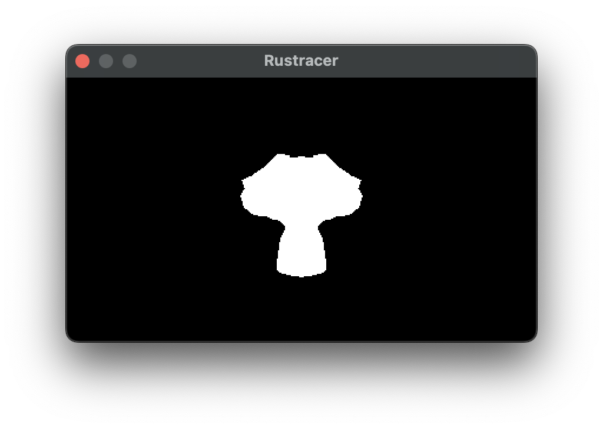
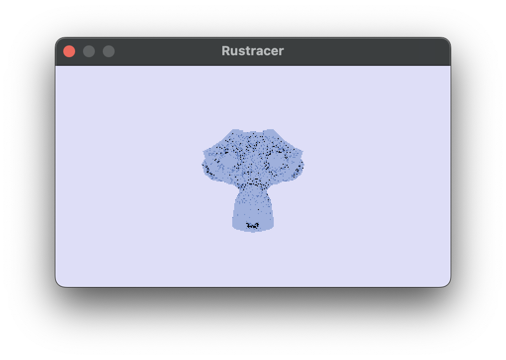
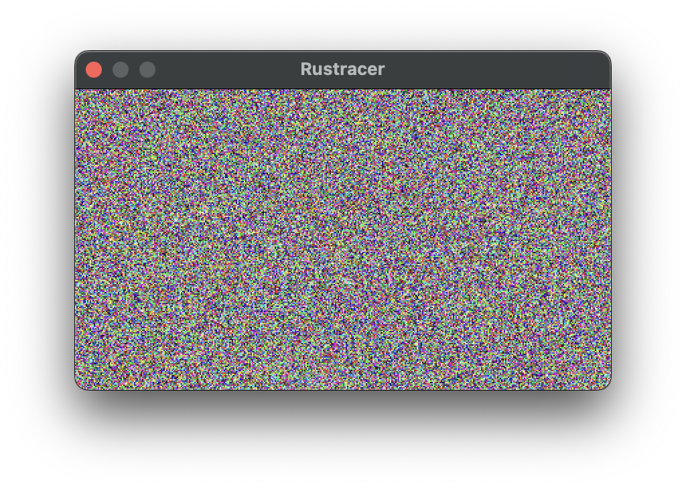
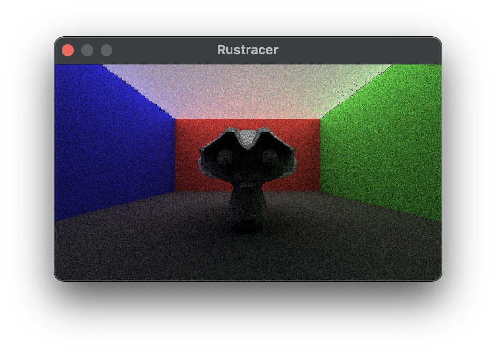

# Porting Ray Tracing to Rust and WebGPU

## Introduction


In this post, I’ll walk through my journey of extending the [Ray Tracing Road to Rust (RTRR)](https://the-ray-tracing-road-to-rust.vercel.app/6-surface-normals-and-multiple-objects) project. I’ll cover how I added triangle support, imported geometry from OBJ files, and started porting the project to WebGPU. If you havent yet done the RTRR then I recommend starting there. If you want to follow along with me without completing RTRR then clone [this branch of the repository (week1)](https://github.com/Jake-Purton/webgpu_ray_trace/tree/stage-1).

## Rendering Triangles on the CPU (Stage 1)

RTRR is a fantastic project for beginners learning rust or ray tracing. It focuses mainly on spheres and I wanted to add triangles. The specific working commit on the CPU is [here](https://github.com/Jake-Purton/webgpu_ray_trace/tree/b26dc46eb08a39acbcfbff3ad3bbe284c25d8d4d) in my repository. Please note that my obj file reading wasn't correct at the time but it was close enough to see some triangles.

**The Triangle Struct**
```rust
// triangle.rs
use std::sync::Arc;

use crate::hittable::{HitRecord, Hittable};
use crate::material::Material;
use crate::ray::Ray;
use crate::vec3::{self, Point3, unit_vector};

pub struct Triangle {
    pub a: Point3,
    pub b: Point3,
    pub c: Point3,
    pub mat: Arc<dyn Material + Send + Sync>,
}

impl Triangle {
    pub fn new(a: Point3, b: Point3, c: Point3, m: Arc<dyn Material + Send + Sync>) -> Triangle {
        Triangle {
            a,
            b,
            c,
            mat: m,
        }
    }
}

impl Hittable for Triangle {
    fn hit(&self, r: &Ray, t_min: f32, t_max: f32, rec: &mut HitRecord) -> bool {
        // Möller–Trumbore intersection algorithm
        let epsilon = 1e-8;
        let edge1 = self.b - self.a;
        let edge2 = self.c - self.a;
        let h = vec3::cross(r.direction(), edge2);
        let a = vec3::dot(edge1, h);

        if a.abs() < epsilon {
            return false; // Ray is parallel to triangle
        }

        let f = 1.0 / a;
        let s = r.origin() - self.a;
        let u = f * vec3::dot(s, h);

        if u < 0.0 || u > 1.0 {
            return false;
        }

        let q = vec3::cross(s, edge1);
        let v = f * vec3::dot(r.direction(), q);

        if v < 0.0 || u + v > 1.0 {
            return false;
        }

        let t = f * vec3::dot(edge2, q);

        if t < t_min || t > t_max {
            return false;
        }

        rec.t = t;
        rec.p = r.at(t);
        let outward_normal = unit_vector(vec3::cross(edge1, edge2));
        rec.set_face_normal(r, outward_normal);
        rec.mat = Some(self.mat.clone());
        true
    }
}
```

This implements the tutorial's `Hittable` trait and can therefore be added to world like so.

```rust
    world.add(Box::new(Triangle::new(
        Point3::new(-4.0_f32, -1.0_f32, -1.0_f32),
        Point3::new(4.0_f32, -1.0_f32, -1.0_f32),
        Point3::new(-4.0_f32, -1.0_f32, -6.0_f32),
        material_ground.clone(),
    )));
```


## Reading Triangles from OBJ Files

To render real models, I used `tobj` to load triangles from OBJ files. Here is an example loading the file 'suzanne.obj'.

```rust
pub fn read_obj_vertices(filename: &str) -> Vec<Triangle> {
    let (models, _) = tobj::load_obj(
        filename,
        &tobj::LoadOptions {
            triangulate: true,
            single_index: true,
            ..Default::default()
        },
    )
    .unwrap();

    let mut triangles: Vec<Triangle> = Vec::new();
    let suzanne_offset = -2.5;

    let material = Arc::new(Lambertian::new(Colour::new(0.8, 0.6, 0.8)));

    for model in models {
        let mesh = &model.mesh;
        let positions = &mesh.positions;
        let indices = &mesh.indices;

        for i in (0..indices.len()).step_by(3) {
            let i0 = indices[i] as usize * 3;
            let i1 = indices[i + 1] as usize * 3;
            let i2 = indices[i + 2] as usize * 3;

            triangles.push(Triangle {
                a: Vec3::new(positions[i0], positions[i0 + 1], positions[i0 + 2] + suzanne_offset),
                b: Vec3::new(positions[i1], positions[i1 + 1], positions[i1 + 2] + suzanne_offset),
                c: Vec3::new(positions[i2], positions[i2 + 1], positions[i2 + 2] + suzanne_offset),
                mat: material.clone()
            });
        }
    }

    triangles
}
```

In our main function we can now get all of the triangles and add them to world.

```rust
let triangles = read_obj_vertices("suzanne.obj");

let mut world = HittableList::new();

for triangle in triangles {
    world.add(
        Box::new(triangle)
    );
}
```

This will work with the RTRR implementation out of the box.

## Preparing for WebGPU (Stage 2)

Currently, with ray tracing running on the CPU the simulation is slow even on relatively high end hardware. Here is an example that took me around 30 seconds to generate:


We can get a huge boost in speed by sending our triangles to the GPU to have the simulation run in paralel there. This will involve sending our triangles in a buffer, implementing a ray tracing shader, and recieving the results as pixels in another buffer before displaying this to the screen.

In stage 2 we will be focusing on how data is passed, and then implementing the collision detection:



The full code is on [this branch](https://github.com/Jake-Purton/webgpu_ray_trace/tree/stage-2).

### Input and Output Buffers

Here is what the setup looks like for sending triangles to the GPU. In the loop where we read the triangles from the obj file before, we now populate a `Vec<u8>`. Our goal is to send 3 sets of 3 `f32`s, however because of how wgsl reads buffers we actually need 4 bytes of padding between each point in the triangle.

```rust
let mut triangles: Vec<u8> = Vec::new();
let suzanne_offset = -2.5;
for model in models {
    let mesh = &model.mesh;
    let positions = &mesh.positions;
    let indices = &mesh.indices;

    for i in (0..indices.len()).step_by(3) {
        let i0 = indices[i] as usize * 3;
        let i1 = indices[i + 1] as usize * 3;
        let i2 = indices[i + 2] as usize * 3;

        // vertex 1
        triangles.extend_from_slice(&positions[i0].to_le_bytes());
        triangles.extend_from_slice(&positions[i0 + 1].to_le_bytes());
        triangles.extend_from_slice(&(positions[i0 + 2] + suzanne_offset).to_le_bytes());
        // pad
        triangles.extend_from_slice(&0.0_f32.to_le_bytes());

        // vertex 2
        triangles.extend_from_slice(&positions[i1].to_le_bytes());
        triangles.extend_from_slice(&positions[i1 + 1].to_le_bytes());
        triangles.extend_from_slice(&(positions[i1 + 2] + suzanne_offset).to_le_bytes());
        // pad
        triangles.extend_from_slice(&0.0_f32.to_le_bytes());

        // vertex 3
        triangles.extend_from_slice(&positions[i2].to_le_bytes());
        triangles.extend_from_slice(&positions[i2 + 1].to_le_bytes());
        triangles.extend_from_slice(&(positions[i2 + 2] + suzanne_offset).to_le_bytes());
        // pad
        triangles.extend_from_slice(&0.0_f32.to_le_bytes());
    }
}
```

The `Vec<u8>` is now in a suitable format. The buffer can be built in rust like so:
```rust
let input_buffer = device.create_buffer_init(&BufferInitDescriptor {
    label: Some("Input Buffer"),
    contents: &v,
    usage: wgpu::BufferUsages::STORAGE | wgpu::BufferUsages::VERTEX,
});
```
and accessed on the GPU:
```wgsl
struct Triangle {
    a: vec4<f32>,
    b: vec4<f32>,
    c: vec4<f32>,
}

@group(0) @binding(0)
var<storage, read> input: array<Triangle>;
```

You may see an error along the lines of:
```
wgpu error: Validation Error

Caused by:
  In Device::create_bind_group, label = 'Bind Group'
    Number of bindings in bind group descriptor (4) does not match the number of bindings defined in the bind group layout (3)
``` 
and you are certain that you have added the correct bindings in your shader, double check that you are using them all. A bit of code like `let a = input[0]` will stop the binding from being removed in the optimisation stage and stop this error from occurring.

An output buffer can be added with a `u32` (format `00RRBBGG`) for each pixel on the screen.
```rust
let output_size = (WIDTH * HEIGHT) * std::mem::size_of::<u32>();

// output buffer in gpu memory
let output_buffer = device.create_buffer(&wgpu::BufferDescriptor {
    label: Some("Output Buffer"),
    size: output_size as u64,
    usage: wgpu::BufferUsages::STORAGE | wgpu::BufferUsages::COPY_SRC,
    mapped_at_creation: false,
});
```

and both of the buffers sent to the GPU:

```rust
let bind_group_layout = compute_pipeline.get_bind_group_layout(0);
let bind_group = device.create_bind_group(&wgpu::BindGroupDescriptor {
    layout: &bind_group_layout,
    entries: &[
        wgpu::BindGroupEntry {
            binding: 0,
            resource: input_buffer.as_entire_binding(),
        },
        wgpu::BindGroupEntry {
            binding: 1,
            resource: output_buffer.as_entire_binding(),
        },
    ],
    label: Some("Bind Group"),
});
```

in `trace.wgsl` add this code for our first basic shader:

```wgsl
struct Triangle {
    a: vec4<f32>,
    b: vec4<f32>,
    c: vec4<f32>,
}

struct Ray {
    origin: vec3<f32>,
    direction: vec3<f32>
}

struct HitRecord {
    t: f32,
    point: vec3<f32>,
    face_normal: vec3<f32>,
    color: vec3<f32>,
    did_hit: bool,
}

@group(0) @binding(0)
var<storage, read> input: array<Triangle>;

@group(0) @binding(1)
var<storage, read_write> output: array<u32>;

fn hit_triangle (r: Ray, t_min: f32, triangle: Triangle) -> HitRecord {

    var hr: HitRecord = HitRecord(
        0.0,
        vec3<f32>(0.0, 0.0, 0.0),
        vec3<f32>(0.0, 0.0, 0.0),
        vec3<f32>(0.0, 0.0, 0.0),
        false,
    );

    let epsilon = 1e-8;
    let edge1 = triangle.b - triangle.a;
    let edge2 = triangle.c - triangle.a;
    let h = cross(r.direction, edge2.xyz);
    let a = dot(edge1.xyz, h);

    if abs(a) < epsilon {
        return hr;
    }

    let f = 1.0 / a;
    let s = r.origin - triangle.a.xyz;
    let u = f * dot(s, h);

    if u < 0.0 || u > 1.0 {
        return hr;
    }

    let q = cross(s, edge1.xyz);
    let v = f * dot(r.direction, q);

    if v < 0.0 || u + v > 1.0 {
        return hr;
    }

    let t = f * dot(edge2.xyz, q);

    // if t < t_min || t > t_max {
    if t < t_min {
        return hr;
    }

    hr.t = t;
    hr.point = (r.direction * t) + r.origin;

    let outward_normal = normalize(cross(edge1.xyz, edge2.xyz));

    if dot(r.direction, outward_normal) < 0.0 {
        hr.face_normal = outward_normal;
    } else {
        hr.face_normal = -outward_normal;
    };

    hr.did_hit = true;

    // choose a colour
    hr.color = vec3(0.7, 0.8, 0.9);

    return hr;
}

fn calculate_collisions(ray: Ray) -> HitRecord {
    var hr: HitRecord = HitRecord(
        1e30, // large initial t
        vec3<f32>(0.0, 0.0, 0.0),
        vec3<f32>(0.0, 0.0, 0.0),
        vec3<f32>(0.0, 0.0, 0.0),
        false,
    );

    // Find nearest hit
    for (var i = 0u; i < arrayLength(&input); i = i + 1u) {
        let triangle = input[i];
        let hit2 = hit_triangle(ray, 0.001, triangle);

        if (!hr.did_hit) || (hit2.t < hr.t && hit2.did_hit){
            hr = hit2;
        }
    }

    return hr;
}

// one thread per pixel!
@compute @workgroup_size(8, 8, 1)
fn main(@builtin(global_invocation_id) gid: vec3<u32>) {
    let x = gid.x;
    let y = gid.y;

    let d = input[0];

    // Guard against extra threads
    if (x >= 400 || y >= 225) {
        return;
    }

    // 1D index into output buffer
    let index = y * 400 + x;

    // Normalized coordinates [0, 1]
    let fx = f32(x) / f32(400 - 1u);
    let fy = f32(225 - 1u - y) / f32(225 - 1u);

    let ray = get_ray(fx, fy);
    
    var c = vec3<f32>(0.0, 0.0, 0.0);

    let hr = calculate_collisions(ray);

    if hr.did_hit == true {
        c = vec3<f32>(1.0, 1.0, 1.0);
    }

    let r: u32 = u32(c.x * 255.0);
    let g: u32 = u32(c.y * 255.0);
    let b: u32 = u32(c.z * 255.0);
    
    output[index] = (r << 16u) | (g << 8u) | b;
}

fn get_ray(u: f32, v: f32) -> Ray {

    let aspect_ratio = 16.0 / 9.0;

    let origin = vec3<f32>(0.0, 0.0, 0.0);
    let viewport_height = 2.0;
    let viewport_width = aspect_ratio * viewport_height;
    let horizontal = vec3<f32>(viewport_width, 0.0, 0.0);
    let vertical = vec3<f32>(0.0, viewport_height, 0.0);
    let focal_length = vec3<f32>(0.0, 0.0, 1.0);
    
    let lower_left_corner = origin - horizontal / 2.0 - vertical / 2.0 - focal_length;

    return Ray (
        origin,
        lower_left_corner + u * horizontal + v * vertical - origin,
    );
}
```

That shader will detect collisions with the triangles, and is the basis for the rest of our project. Back in rust, here is the code used to get the gpu device, setup the bindings, execute the shader, and update the window.

```rust
fn main() {

    let triangles = read_obj_vertices("suzanne.obj");

    let instance = Instance::new(&InstanceDescriptor {
        ..Default::default()
    });

    let adapter = pollster::block_on(instance.request_adapter(&wgpu::RequestAdapterOptions {
        power_preference: wgpu::PowerPreference::HighPerformance,
        force_fallback_adapter: false,
        compatible_surface: None,
    }));

    let adapter = match adapter {
        Ok(a) => {
            println!("Adapter found: {:?}", a.get_info().name);
            a
        }
        Err(_) => {
            println!("ERROR: No GPU adapter found. WebGPU may not be supported in this browser.");
            return;
        }
    };

    let (device, queue) =
        match pollster::block_on(adapter.request_device(&wgpu::DeviceDescriptor::default())) {
            Ok(a) => a,
            Err(e) => {
                println!("{e}");
                return;
            }
        };

    let input_buffer = device.create_buffer_init(&BufferInitDescriptor {
        label: Some("Input Buffer"),
        contents: &triangles,
        usage: wgpu::BufferUsages::STORAGE | wgpu::BufferUsages::VERTEX,
    });


    let output_size = (WIDTH * HEIGHT) * std::mem::size_of::<u32>();

    // output buffer in gpu memory
    let output_buffer = device.create_buffer(&wgpu::BufferDescriptor {
        label: Some("Output Buffer"),
        size: output_size as u64,
        usage: wgpu::BufferUsages::STORAGE | wgpu::BufferUsages::COPY_SRC,
        mapped_at_creation: false,
    });

    // read the output into cpu memory
    let staging_buffer = device.create_buffer(&wgpu::BufferDescriptor {
        label: Some("Staging Buffer"),
        size: output_size as u64,
        usage: wgpu::BufferUsages::MAP_READ | wgpu::BufferUsages::COPY_DST,
        mapped_at_creation: false,
    });

    let shader = device.create_shader_module(wgpu::ShaderModuleDescriptor {
        label: Some("Tracing Shader"),
        source: wgpu::ShaderSource::Wgsl(include_str!("trace.wgsl").into()),
    });

    let compute_pipeline = device.create_compute_pipeline(&wgpu::ComputePipelineDescriptor {
        label: Some("Compute Pipeline"),
        layout: None,
        module: &shader,
        entry_point: Some("main"),
        compilation_options: wgpu::PipelineCompilationOptions::default(),
        cache: None,
    });

    let bind_group_layout = compute_pipeline.get_bind_group_layout(0);
    let bind_group = device.create_bind_group(&wgpu::BindGroupDescriptor {
        layout: &bind_group_layout,
        entries: &[
            wgpu::BindGroupEntry {
                binding: 0,
                resource: input_buffer.as_entire_binding(),
            },
            wgpu::BindGroupEntry {
                binding: 1,
                resource: output_buffer.as_entire_binding(),
            },
        ],
        label: Some("Bind Group"),
    });

    let mut encoder = device.create_command_encoder(&wgpu::CommandEncoderDescriptor {
        label: Some("Compute Encoder"),
    });

    {
        let mut cpass = encoder.begin_compute_pass(&wgpu::ComputePassDescriptor {
            label: Some("Compute Pass"),
            timestamp_writes: None,
        });
        cpass.set_pipeline(&compute_pipeline);
        cpass.set_bind_group(0, &bind_group, &[]);

        cpass.dispatch_workgroups(
            ((WIDTH + 7) / 8).try_into().unwrap(),
            ((HEIGHT + 7) / 8).try_into().unwrap(),
            1,
        ); // example workgroup
    }

    encoder.copy_buffer_to_buffer(
        &output_buffer,
        0,
        &staging_buffer,
        0,
        Some(output_size as u64),
    );

    queue.submit(Some(encoder.finish()));

    let buffer_slice = staging_buffer.slice(..);
    buffer_slice.map_async(wgpu::MapMode::Read, |_| {});
    device
        .poll(wgpu::PollType::wait_indefinitely())
        .expect("hello");

    let data = buffer_slice.get_mapped_range();
    let result: &[u32] = bytemuck::cast_slice(&data);


    // Create the window
    let mut window = Window::new(
        "Rustracer",
        WIDTH,
        HEIGHT,
        WindowOptions::default(),
    )
    .unwrap_or_else(|e| {
        panic!("{}", e);
    });

    while window.is_open() && !window.is_key_down(Key::Escape) {
        window.update_with_buffer(&result, WIDTH, HEIGHT).unwrap();
    }
}
```

## Bouncing Rays (Stage 3)

[Stage 3 code](https://github.com/Jake-Purton/webgpu_ray_trace/tree/stage-3). Now we can start bouncing rays around. All of this logic is the same as in RTRR, just with some workarounds made to fit wgsl. The main differences are randomness, and recursion. At the end of this part of the tutorial you'll have something that looks like this:



### Randomness

There is no `crate::rand` on the GPU. We will have to implement a hash function to generate our own pseudo-randomness from a seed.

```wgsl
// a hash function which was generated by an LLM. I do not know its origin
fn hash_u32(seed: u32) -> u32 {
    var v = seed;
    v = v * 747796405u + 2891336453u;
    v = ((v >> ((v >> 28u) + 4u)) ^ v) * 277803737u;
    v = (v >> 22u) ^ v;
    return v;
}
```

This can be used like so to generate an `f32`, we divide by `4294967296.0` to get a random number between `0` and `1`. We can use this as a drop-in replacement for `random_double()`.

```wgsl
fn random_float(seed:u32) -> f32 {
    let a = hash_u32(seed);
    let fa = f32(a);
    return (fa) * (1.0 / 4294967296.0);
}
```

This function generates a uniformly random direction on the unit sphere by randomly sampling a z-coordinate and an angle, computing the corresponding x and y values, and then flipping the vector if necessary so it lies in the same hemisphere as the given normal.

```wgsl
fn random_hemisphere_direction(normal: vec3<f32>, seed: u32) -> vec3<f32> {
    let z = random_float(seed) * 2.0 - 1.0;
    let a = random_float(seed + 1u) * 6.28318530718;

    let r = sqrt(max(0.0, 1.0 - z * z));
    let v = vec3<f32>(
        r * cos(a), 
        r * sin(a),
        z
    );

    if dot(v, normal) < 0 {
        return -v;
    } else {
        return v;
    }
}
```

We generate a unique seed by combining the pixel coordinates, and sample index, each multiplied by large constants to reduce correlation between nearby values. Then we hash the combined result to produce a well-mixed 32-bit pseudorandom seed.

```wgsl
fn make_seed(x: u32, y: u32, sample: u32) -> u32 {
    var s = x * 1973u + y * 9277u + sample * 26699u;
    return hash_u32(s);
}
```

If you output just the seed generated like so: 

```wgsl
@compute @workgroup_size(8, 8, 1)
fn main(@builtin(global_invocation_id) gid: vec3<u32>) {
    let x = gid.x;
    let y = gid.y;

    let d = input[0];

    // Guard against extra threads
    if (x >= 400 || y >= 225) {
        return;
    }

    // 1D index into output buffer
    let index = y * 400 + x;
    
    let seed = make_seed(x, y, 0u);

    output[index] = seed;
}
```

You will see random noisy fuzz:


### Colour Ray

To colours rays, we must create an iterative equivalent to the RTRR `ray_color` function as WGSL does not support recursive functions. This implementation was based off of code used in Sebastian Lague's ray tracing video, and builds up the accumulated colour and incoming light of the ray. After every collision with a triangle, the ray bounces until the maximum depth is reached. Until we add materials, the triangle colours will be hardcoded, and the only light will come from the sky.

```wgsl
fn ray_color_iter(r_in: Ray, max_depth: u32, seed: u32) -> vec3<f32> {
    var incoming_light = vec3<f32>(0.0, 0.0, 0.0);
    var color = vec3<f32>(1.0, 1.0, 1.0); // accumulated color
    var ray = r_in;
    var depth = max_depth;

    loop {
        if depth == 0u {
            break;
        }

        let hr = calculate_collisions(ray);

        if hr.did_hit {
            ray.origin = hr.point;
            ray.direction = random_hemisphere_direction(hr.face_normal, seed+depth);

            // let emitted_light = hr.emmitted_colour * hr.emmitted_strength;
            // incoming_light += emitted_light * color;
            color *= hr.color;
        } else {
            // background emitted color * emmission_strength
            let e = vec3(0.88, 0.88, 0.99) * .99;
            incoming_light += e * color;
            break;
        }

        depth = depth - 1u;
    }

    return incoming_light;
}
```

Now update main to include `ray_color_iter()`:

```wgsl

fn main(@builtin(global_invocation_id) gid: vec3<u32>) {
    // ...
    let ray = get_ray(fx, fy);
    
    let seed = make_seed(x, y, 0u);

    // depth of 4
    var c = ray_color_iter(ray, 4u, seed);

    let r: u32 = u32(c.x * 255.0);
    let g: u32 = u32(c.y * 255.0);
    let b: u32 = u32(c.z * 255.0);
    
    output[index] = (r << 16u) | (g << 8u) | b;
    // ...
}
```

When you run this you should see your infront of a nice blue/gray sky.

## Materials and the Camera (Stage 4)

The code for stage 4 is in [this branch](https://github.com/Jake-Purton/webgpu_ray_trace/tree/stage-4). At the end of this stage you'll be able to render this:



The camera works a similar way to how it does in the tutorial.
```rust
#[repr(C)]
#[derive(Copy, Clone, bytemuck::Pod, bytemuck::Zeroable)]
pub struct Camera {
    origin: [f32; 4],
    lower_left_corner: [f32; 4],
    horizontal: [f32; 4],
    vertical: [f32; 4],
}
```
The Vec3 data structure has been replaced with `[f32; 4]` so that thr padding works. This can be sent to the GPU in the parameters buffer which also describes:
- screen width/height
- number of samples per pixel
- maximum depth

Padding is included due to how the GPU deserialises the bytes.

```rust
#[repr(C)]
#[derive(Copy, Clone, bytemuck::Pod, bytemuck::Zeroable)]
struct Params {
    width: u32,
    height: u32,
    _pad1: u32,
    _pad2: u32,
    camera: Camera,
    depth: u32,
    samples: u32,
    _pad5: u32,
    _pad6: u32,
}
```

I also send the materials through a buffer so that multiple triangles can use the same material. When a triangle is hit we access `materials[u32(triangle.a.w)];`. `materials` describe the reflection colour and light emmitance of a triangle. The Material struct also has a reserved `type` attribute that could be used to describe the kind of reflections (only lambertian supported at the time of editing, could include metallic etc.)

```wgsl
// wgsl
struct Material {
    // colour of the surface when it reflects light
    emmission: vec4<f32>, // first 3 f32s is the emmission colour, last is the coefficient (emmission strength)
    albedo: vec4<f32>,
    material_type: u32, // metallic or lambertian
}

@group(0) @binding(3)
var<storage, read> materials: array<Material>;
```

## The future of this project

This project is not close to done. I'd like to keep working on it and these are the things I would work on next. Please consider forking [the repository](https://github.com/Jake-Purton/webgpu_ray_trace) and adding any of these features. If you do add any then also add a markdown file with a little detail about your journey into coming up with the solution. Contributions to both the tutorial and the project are welcome.
- recompute each frame
- add metallic and glass etc materials
- implement a movable camera
- modularity of wgsl using string concatenation
- BVH optimisation for collisions
- denoising

## References

- [Ray Tracing Road to Rust](https://the-ray-tracing-road-to-rust.vercel.app/6-surface-normals-and-multiple-objects)
- [Sebastian Lague - Coding Adventures: Ray Tracing ](https://www.youtube.com/watch?v=Qz0KTGYJtUk)